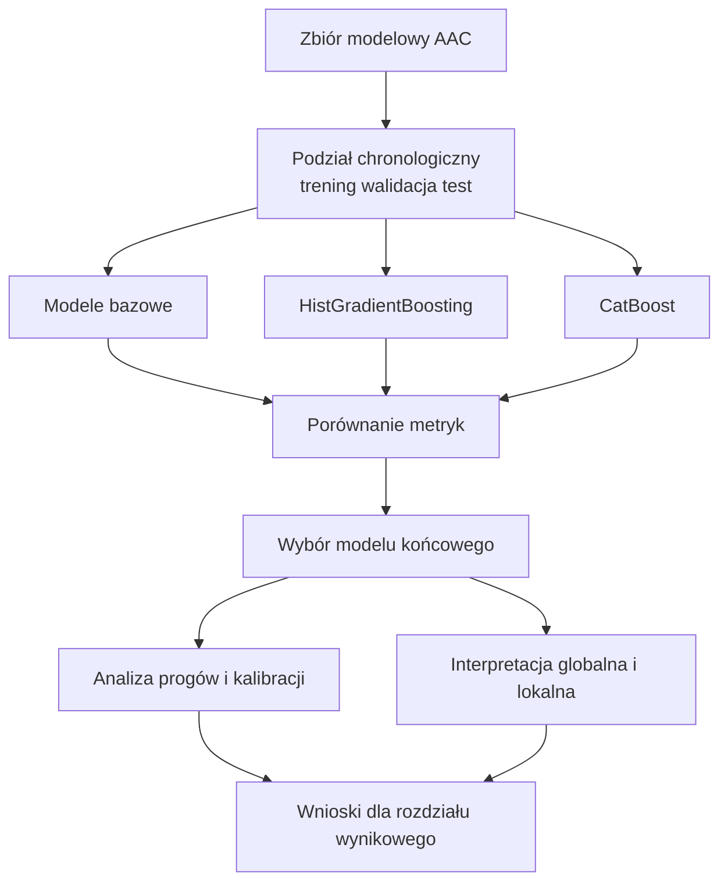

# 5. Wyniki badań i interpretacja modeli

## 5.1. Ramy interpretacyjne rozdziału

Rozdział wynikowy zamyka logikę pracy przyjętą w poprzednich etapach: po części poświęconej przygotowaniu zbioru danych oraz po części metodologicznej następuje prezentacja rezultatów, porównanie jakości modeli i interpretacja najważniejszych zależności. Badanie opiera się na 162 390 dopasowanych epizodach pobytu (przyjęcie–wynik) dla psów i kotów, ocenianych w rygorystycznym układzie chronologicznym: lata 2013–2021 wykorzystano do uczenia modeli, lata 2022–2023 do walidacji (w tym wyznaczania progów decyzyjnych), a lata 2024–2025 do końcowego, jednokrotnego testu. Taki układ stanowi podstawę wszelkich porównań, ponieważ wymusza ostrożność w formułowaniu wniosków i chroni przed zjawiskiem wycieku danych z przyszłości.

Konsekwentnie utrzymano rozróżnienie między dwoma niezależnymi zadaniami predykcyjnymi. Klasyfikacja dotyczy prawdopodobieństwa adopcji. Regresja z kolei opisuje przewidywaną liczbę dni do *dowolnego* dopasowanego wyniku pobytu. Zmienna regresyjna nie może być zatem utożsamiana z "szybkością adopcji", gdyż obejmuje także eutanazję czy powrót do właściciela. Atrybut `days_to_adoption` ma charakter wyłącznie pomocniczy i opisowy. W ocenie klasyfikatorów zastosowano miary takie jak ROC-AUC, PR-AUC, Precision, Recall i F1-Score, natomiast ocena jakości regresji opiera się na błędach MAE, RMSE i MedAE.

Rozdział ten koncentruje się na języku wyników badawczych. Wskazano tu, które rozwiązania algorytmiczne okazały się najsilniejsze, które hipotezy znalazły wsparcie w materiale empirycznym oraz gdzie model zachowuje się stabilnie.

## 5.2. Porównanie jakości modeli

Wyniki testowe (lata 2024-2025) wskazują na wyraźny podział ról pomiędzy rodzinami modeli. W zadaniu klasyfikacji adopcji najwyższe rezultaty osiągnął algorytm HistGradientBoosting. W zadaniu regresji długości pobytu bezkonkurencyjny okazał się CatBoost. 

Można na tej podstawie sformułować kilka kluczowych obserwacji. Po pierwsze, klasyfikacja (AUC rzędu 0,840) okazuje się zadaniem operacyjnie łatwiejszym i bardziej stabilnym niż regresja czasu pobytu (MAE rzędu 18,5 dnia). Po drugie, wyniki dla kotów są zauważalnie lepsze niż dla psów, co sugeruje, że ich ścieżki w schronisku podlegają bardziej ustandaryzowanym, przewidywalnym regułom.

Zwizualizowanie wyników na krzywych ułatwia ocenę skali przewagi modeli złożonych. Poniższy wykres udowadnia deklasację modeli bazowych (Logistycznej Regresji) przez modele z rodziny Boosting.

*[Rysunek 5.2. Zbiorcze porównanie zdolności dyskryminacyjnej badanych algorytmów na zbiorze łącznym oraz podzbiorach gatunkowych.]*

Poniższa tabela zestawia dokładne miary na odłożonym zbiorze testowym.

**Tabela 5.1. Wyniki najlepszych modeli na zbiorze testowym (2024-2025)**

| Zadanie | Podzbiór danych | Najlepszy model | Główna miara (ROC-AUC / MAE) | PR-AUC | F1-Score | Precision | Recall | RMSE | MedAE |
|---|---|---|---|---|---|---|---|---|---|
| Klasyfikacja | Zbiór łączny | HistGradientBoosting | **0,840** (ROC-AUC) | 0,884 | 0,818 | 0,835 | 0,801 | - | - |
| Klasyfikacja | Psy | HistGradientBoosting | **0,806** (ROC-AUC) | 0,857 | 0,799 | 0,817 | 0,781 | - | - |
| Klasyfikacja | Koty | HistGradientBoosting | **0,865** (ROC-AUC) | 0,899 | 0,842 | 0,846 | 0,839 | - | - |
| Regresja | Zbiór łączny | CatBoost | **18,55** (MAE dni) | - | - | - | - | 38,36 | 6,28 |
| Regresja | Psy | CatBoost | **21,56** (MAE dni) | - | - | - | - | 45,99 | 6,28 |
| Regresja | Koty | CatBoost | **15,79** (MAE dni) | - | - | - | - | 30,12 | 5,71 |

Wyniki te dobrze wpisują się w logikę porównań metodologicznych. Proste modele bazowe (np. naiwne przewidywanie mediany lub dominanty) pozwoliły udowodnić, że w danych w ogóle występuje sygnał predykcyjny. Faktyczny ciężar analityczny spoczywa jednak na algorytmach boostingowych. O ile regresja logistyczna daje prostszy wgląd w kierunek zależności, modele nieliniowe znacznie lepiej wykorzystują strukturę danych tabelarycznych.

*[Rysunek 5.3. Szczegółowy przebieg krzywej ROC dla zwycięskiego klasyfikatora (HistGradientBoosting). Widoczne wyraźne wysklepienie nad linią losową (AUC = 0.50).]*

Należy również odnotować rolę cech kontekstowych. Wzbogacenie zbioru o pogodę czy wcześniejszy wolumen przyjęć nie przyniosło drastycznej, jednolitej poprawy we wszystkich rodzinach modeli. W klasyfikacji odnotowano minimalny zysk dla CatBoosta w zbiorze łącznym, bez znaczącej poprawy dla podzbioru psów. Obserwacja ta stanowi argument za umiarkowaną oceną przydatności zewnętrznego kontekstu środowiskowego w momencie przyjęcia.

Poniższy schemat porządkuje logiczną ścieżkę analizy i wyboru modeli zastosowaną w badaniu.

*[Rysunek 5.1. Logika ewaluacji modeli klasyfikacyjnych i regresyjnych]*

## 5.3. Weryfikacja hipotez badawczych

Z perspektywy pytań badawczych kluczowe pozostają trzy główne hipotezy: H1, H3 i H5. 

**Hipoteza H1 (Wpływ okoliczności przyjęcia w relacji do wyglądu)**
Hipoteza o większym znaczeniu okoliczności przyjęcia niż fizycznych cech wyglądu znajduje potwierdzenie. W warstwie opisowej zrzeczenie właścicielskie (`Owner Surrender`) oraz kategoria `Abandoned` są powiązane z najwyższymi wskaźnikami adopcji. W warstwie modelowej, w analizach SHAP oraz ablacji Rodzin Cech, grupy zmiennych opisujących okoliczności i typ przyjęcia mają silniejszy sygnał predykcyjny niż cechy wyglądu (kolor). Należy to jednak interpretować w słowniku asocjacji statystycznych, a nie ścisłych związków przyczynowych.

*[Rysunek 5.2. Porównanie ważności rodzin cech dla wyniku klasyfikacji. Cechy okoliczności przyjęcia (Intake) dominują nad wyglądem.]*

**Hipoteza H3 (Wpływ wieku zwierzęcia)**
Wiek zwierzęcia jest niezwykle silnym predyktorem, co w pełni wspiera postawioną hipotezę. Wyniki jednoznacznie wskazują na najwyższą adopcyjność najmłodszych zwierząt. Grupa najmłodsza (`Baby`) charakteryzuje się wskaźnikiem adopcji na poziomie 59,7%, młodzież (`Young`) wypada słabiej (47,5%), lecz znacząco lepiej od zwierząt dorosłych (39,6%) i seniorów (31,0%). Zmienna wieku należy do czołowych determinant decyzyjnych w wyjaśnieniach globalnych modelu.

*[Rysunek 5.3. Spadek prawdopodobieństwa adopcji postępujący wraz z wiekiem zwierzęcia (w latach).]*

**Hipoteza H5 (Okres pandemii COVID-19)**
Hipoteza odnosząca się do pandemii zostaje wsparta dowodami opisowymi. Udokumentowano wyższe odsetki adopcji w okresie pandemicznym i postpandemicznym (wzrost z 46,3% przed pandemią do 61,5% po pandemii), ale równocześnie zanotowano znaczny wzrost mediany liczby dni do opuszczenia schroniska (z 5,25 dnia do 9,83 dnia). To podwójne, pozornie sprzeczne przesunięcie dowodzi, że efekt COVID-19 wiązał się ze strukturalną zmianą populacji przyjmowanej do placówek oraz pojemności operacyjnej ośrodka, a nie tylko z prostym "zwiększeniem popytu na adopcje".

*[Rysunek 5.4. Różnice we wskaźnikach adopcji przed, w trakcie oraz po pandemii COVID-19.]*

Hipotezy H2 (sezonowość) i H4 (ciemne umaszczenie) mają charakter pomocniczy. Zwierzęta zaliczone do kategorii technicznej `is_black_or_dark` wykazują historycznie niższe wskaźniki adopcji, jednak wynik ten nie stanowi jednoznacznego dowodu dyskryminacji ze strony adoptujących, a jedynie statystyczną asocjację obserwowaną w danych.

**Tabela 5.2. Status hipotez badawczych w świetle wyników**

| Hipoteza | Zakres | Status | Najważniejsza obserwacja |
|---|---|---|---|
| H1 | Okoliczności przyjęcia vs wygląd | Wsparta opisowo i predykcyjnie | Cechy intake-related wykazują wyższą doniosłość (SHAP importance) niż atrybuty umaszczenia. |
| H2 | Sezonowość | Analiza opisowa | Różnice sezonowe istnieją, ale stanowią czynnik drugorzędny predykcyjnie. |
| H3 | Wiek | Wsparta opisowo i predykcyjnie | Wskaźnik adopcji maleje z 59,7% (`baby`) do 31,0% (`senior`). |
| H4 | Ciemne umaszczenie | Analiza opisowa | Niższa obserwowana adopcyjność w technicznej kategorii `dark/black`. |
| H5 | Okres COVID-19 | Wsparta opisowo | Wzrost adopcji (z 46% do 61%) przy jednoczesnym wzroście czasu pobytu (z 5 do 9 dni mediany). |

## 5.4. Interpretacja i wiarygodność modelu

Warstwa interpretacyjna wykorzystuje metody z zakresu *Explainable AI* (XAI), w szczególności wartości SHAP. Decyzja o wdrożeniu XAI podyktowana była wymogami środowiska operacyjnego. W kontekście weterynaryjnym i schroniskowym (gdzie ważą się losy żywych zwierząt), modele będące "czarnymi skrzynkami" (ang. *black-box*) spotykają się z naturalnym odrzuceniem przez personel medyczny i behawiorystów z powodu braku zaufania. Pracownik schroniska musi rozumieć, dlaczego model zaklasyfikował szczeniaka jako przypadek podwyższonego ryzyka. Pozwala to na uniknięcie ślepego podążania za algorytmem. Co istotne, wizualizacje globalne (SHAP Summary) potwierdzają empiryczne obserwacje personelu — m.in. silny, ujemny wpływ starszego wieku i pozytywny wpływ młodego wieku na predykcję adopcji, co buduje zaufanie do kompetencji predykcyjnych modelu.

Kwestią metodologiczną wymagającą podkreślenia jest fakt, że najlepszym klasyfikatorem testowym okazał się HistGradientBoosting, natomiast pełna generacja wykresów SHAP (ze względów technologicznych oraz dostępności narzędzi objaśniających *TreeExplainer*) jest często bardziej natywna dla modelu CatBoost. W niniejszej pracy narzędzia interpretacyjne stosowane są wobec modeli wspomagających, służących do objaśniania kierunków zależności.

Drugim filarem użyteczności jest kalibracja. Wysoka wartość ROC-AUC nie wystarcza do uznania modelu probabilistycznego za w pełni rygorystyczny, jeśli np. model myli się na skrajach predykcji.

*[Rysunek 5.8. Krzywa kalibracyjna (Calibration Curve) dowodząca, w jakim stopniu przewidywane przez model prawdopodobieństwo adopcji odpowiada rzeczywistej częstotliwości (Perfectly calibrated).]*

Oszacowania modelu zostały zweryfikowane pod kątem luki kalibracyjnej (Brier Score) i progów decyzyjnych (`threshold`), które dobierano na niezależnym zbiorze walidacyjnym z lat 2022-2023 i bez modyfikacji przeniesiono na zbiór testowy 2024-2025. W podgrupach charakteryzujących się bardzo małymi liczebnościami (poniżej 100 obserwacji w zbiorze testowym) zachowano szczególną ostrożność ewaluacyjną.

Rozdział ten uwypukla fakt, że problem regresyjny ujawnił nieuchronne granice dokładności predykcji stochastycznych procesów społecznych. Model nie jest "wyrocznią" potrafiącą wskazać dokładny dzień opuszczenia schroniska przez psa, lecz zaawansowanym filtrem ryzyka. To obiektywne rozpoznanie stanowi fundament dla architektury aplikacji wdrożeniowej (Dashboardu) i struktury środowiska MLOps opisanej w kolejnym rozdziale.
